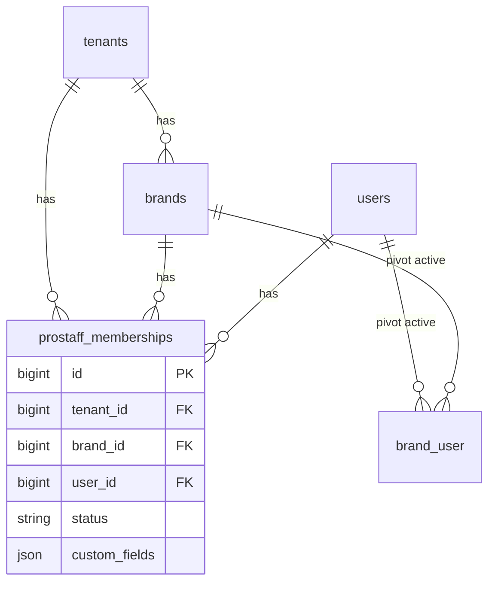

# Creator / Prostaff — Phase 1 (Data Foundation)

Phase 1 adds the `prostaff_memberships` table and Eloquent layer **without** wiring approval, uploads, notifications, or UI.

## Nine-phase program (outline)

| Phase | Focus |
|-------|--------|
| **1** | Data foundation — this document |
| **2–9** | Reserved (approval, upload pipeline, notifications, UI, and related product work — to be specified per phase) |

## Table: `prostaff_memberships`

Migration: `database/migrations/2026_04_05_120000_create_prostaff_memberships_table.php`.

| Column | Type | Notes |
|--------|------|--------|
| `id` | bigint | Primary key |
| `tenant_id` | FK → `tenants` | Cascade delete; must equal `brands.tenant_id` for `brand_id` |
| `brand_id` | FK → `brands` | Cascade delete |
| `user_id` | FK → `users` | Cascade delete |
| `status` | string | Default `active` — intended values: `active`, `paused`, `removed` |
| `target_uploads` | int, nullable | Target system (Phase 1 stores only) |
| `period_type` | string, nullable | e.g. `month`, `quarter`, `year` |
| `period_start` | date, nullable | |
| `requires_approval` | boolean | Default `true` (product intent: always on logically) |
| `custom_fields` | json, nullable | Per-membership extensibility |
| `assigned_by_user_id` | FK → `users`, nullable | `nullOnDelete` when assigner user is deleted |
| `started_at`, `ended_at` | timestamp, nullable | Audit / lifecycle |
| `created_at`, `updated_at` | timestamps | |

### Constraints

**Database**

- **Unique:** `(brand_id, user_id)` — one prostaff row per user per brand.
- **Foreign keys:** `tenant_id`, `brand_id`, `user_id` cascade on delete; `assigned_by_user_id` sets null on delete.

**Application (Eloquent `saving` → `ProstaffMembership::assertEligibilityRules()`)**

See [Eligibility rules](#eligibility-rules-enforced-on-save) below. Raw SQL or DB inserts **bypass** these checks.

## Relationship diagram



## Model: `App\Models\ProstaffMembership`

- **Relationships:** `user()`, `brand()`, `tenant()`, `assignedByUser()`
- **Saving:** `saving` event runs `assertEligibilityRules()` (see below).

## Helpers

| Location | Method | Behavior |
|----------|--------|----------|
| `User` | `prostaffMemberships()` | `HasMany` — all rows for the user |
| `User` | `prostaffMembershipForBrand(Brand $brand)` | First `ProstaffMembership` for that brand (unique guarantees at most one) |
| `Brand` | `prostaffMemberships()` | `HasMany` |
| `Brand` | `prostaffMembers()` | `BelongsToMany` `User` via `prostaff_memberships` with pivot columns |

## Eligibility rules (enforced on save)

Creating or updating a `ProstaffMembership` **throws `InvalidArgumentException`** if:

1. **`tenant_id`** does not match **`brands.tenant_id`** for the given `brand_id`.
2. The user is **not** on the tenant (`tenant_user`).
3. There is **no active** `brand_user` row (`removed_at IS NULL`) for `(user_id, brand_id)`.
4. The active brand role is missing or **invalid** (per `RoleRegistry`).
5. The active brand role is **`admin`** or **`brand_manager`** (`RoleRegistry::isBrandApproverRole()`).

**Allowed** brand role for prostaff: **`contributor`** only (Phase 2+; Phase 1 schema allowed broader roles until enforcement tightened).

Raw SQL or tinker that bypasses Eloquent **will not** run these checks; use `ProstaffMembership::create()` / `save()` for consistency.

## Phase 1 test checklist

### Manual (tinker / DB)

After `php artisan migrate`:

1. Assign prostaff manually for a user who is on the **tenant**, has an **active** `brand_user` row (`removed_at` null), and brand role **not** `admin` / `brand_manager` (e.g. `contributor` or `viewer`):

```php
$brand = Brand::first();
$user = User::where('email', '…')->first();

ProstaffMembership::create([
    'tenant_id' => $brand->tenant_id,
    'brand_id' => $brand->id,
    'user_id' => $user->id,
]);
```

2. Confirm the row is linked to the correct **tenant** and **brand** (`tenant_id`, `brand_id`, `user_id`).
3. Confirm you **cannot** insert a duplicate for the same `(brand_id, user_id)` (unique index / `QueryException`).
4. Confirm **`$user->prostaffMembershipForBrand($brand)`** returns that membership.
5. Confirm **`$brand->prostaffMembers`** includes the user (e.g. `$brand->prostaffMembers()->where('users.id', $user->id)->exists()`).

### Automated

Run: `php artisan test tests/Feature/ProstaffMembershipPhase1Test.php`

Covers: happy path, unique constraint, mismatched tenant, missing tenant membership, missing `brand_user`, `admin` / `brand_manager` rejection, and helper resolution.

## Out of scope (later phases)

- Approval pipeline, upload gates, notifications, billing/plan flags, admin UI, and effective permission changes.
