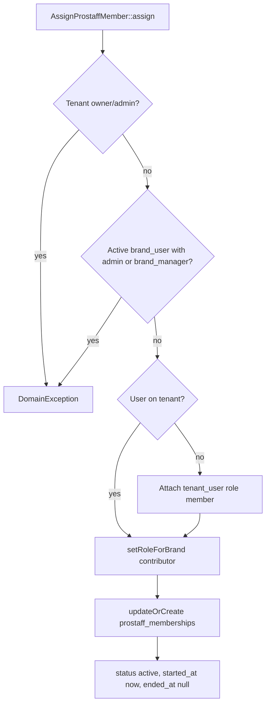

# Creator / Prostaff — Phase 2 (Assignment + Enforcement)

Phase 2 adds **controlled assignment** of prostaff members, **runtime enforcement** of contributor + approval behavior, and **removal** (soft state) — without changing approval services, upload jobs, or introducing new roles.

## Assignment flow

**Service:** `App\Services\Prostaff\AssignProstaffMember`  
**Method:** `assign(User $user, Brand $brand, array $data = []): ProstaffMembership`

**`$data` keys (optional):** `target_uploads`, `period_type`, `period_start`, `assigned_by_user_id`, `custom_fields`

**Idempotent assign:** If a row already exists for `(brand_id, user_id)` with `status = active`, `assign()` returns that membership **without** updating targets, period, or other fields (avoids resetting goals mid-period). Removed/paused rows still go through the full assign path and `updateOrCreate`.

## Removal flow

**Service:** `App\Services\Prostaff\RemoveProstaffMember`  
**Method:** `remove(ProstaffMembership $membership): void`

- Sets `status` = `removed`, `ended_at` = now  
- Row is **not** deleted (audit + history)

## Role constraints

| Layer | Rule |
|--------|------|
| **Tenant** | User must **not** be tenant `owner` or `admin` (checked before provisioning). |
| **Brand (active pivot)** | User must **not** have brand role `admin` or `brand_manager`. |
| **After assign** | Brand role is always **`contributor`** (`setRoleForBrand`). |
| **Model save** | `ProstaffMembership::assertEligibilityRules()` requires active `brand_user`, role **`contributor`**, and not approver roles (defense in depth). |

## Runtime `requires_approval` override

`User::activeBrandMembership(Brand $brand)` still reads `brand_user.requires_approval` from the database, but **if** the user has an **active** prostaff row for that brand (`User::isProstaffForBrand($brand)`), the returned array forces:

`requires_approval` => **true**

This is **not** written back to `brand_user`; it only affects callers using `activeBrandMembership()`.

## User helpers

| Method | Purpose |
|--------|---------|
| `activeProstaffMembership(Brand $brand): ?ProstaffMembership` | The **active** prostaff row only; prefer this in Phase 3+ to avoid duplicate queries/logic. |
| `isProstaffForBrand(Brand $brand): bool` | `true` when `activeProstaffMembership` is non-null. |
| `forgetActiveBrandMembershipForBrand(Brand $brand)` | Clears in-request cache after pivot/prostaff changes. |
| `forgetTenantRoleCacheForTenant(Tenant $tenant)` | Clears tenant role cache after attaching to tenant. |

## Indexes (performance)

Composite indexes on `prostaff_memberships`: `(brand_id, status)` and `(tenant_id, status)` (see migration `2026_04_05_190000_add_indexes_to_prostaff_memberships_table.php`).

## Tests

`tests/Feature/ProstaffAssignmentTest.php` — tenant/brand provisioning, contributor forcing, tenant admin/owner + brand_manager blocks, runtime approval override, removal behavior.

## Out of scope (later phases)

- Approval pipeline services, upload gating, notifications, admin UI, billing.
