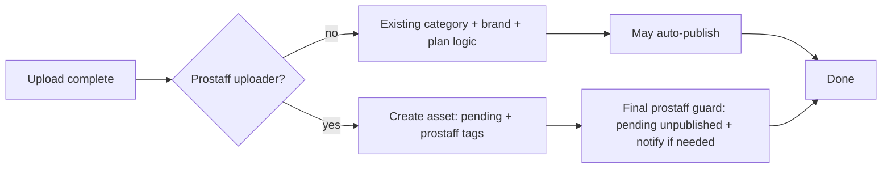

# Creator / Prostaff — Phase 3 (Upload + Approval Integration)

Phase 3 ensures **prostaff uploads always enter the existing asset approval workflow** (pending, unpublished until approved) and tags rows for reporting, **without** adding a separate metadata-approval product.

## Prostaff vs normal upload

| Aspect | Normal uploader | Active prostaff (`User::isProstaffForBrand`) |
|--------|-----------------|-----------------------------------------------|
| `approval_status` after upload | From category rules, plan gate, `brand_user.requires_approval`, contributor toggles | **Always `pending`** (after upload completion runs) |
| `published_at` / `published_by_id` | May be set when rules allow auto-publish | **Forced `null`** on new upload |
| `submitted_by_prostaff` | `false` (default) | **`true`** |
| `prostaff_user_id` | `null` | **Uploader’s user id** |
| Plan / contributor flags | Gated by `FeatureGate::approvalsEnabled`, brand settings | **Overridden** for prostaff on **new** uploads via `UploadCompletionService` |

**Replace / new version (prostaff):** If the uploader is prostaff for the asset’s brand, the replace path sets **`pending`**, clears **publish** fields, and sets the prostaff tag — even when the legacy replace comment says “do not unpublish” for normal users.

## Approval = metadata approval (UI contract)

There is **no** parallel “metadata approval” system for prostaff.

- **Product rule:** When an approver uses **Approve asset**, they are expected to have reviewed **file + metadata** in the existing UI. Approving the asset is the **implicit acceptance** of the metadata shown with that review.
- **Technical rule:** Asset approval continues to use `AssetApprovalController` and `approval_status` only; per-field metadata approval endpoints remain separate and are **not** required for prostaff closure unless product later extends the UI.

Optional future enhancement: include `is_prostaff_asset` (from `submitted_by_prostaff`) in approval API payloads for UI badges — not required for correctness.

## Upload lifecycle (new asset)

Implementation: `App\Services\UploadCompletionService` — initial create fields + `applyProstaffNewUploadApprovalEnforcement()` after category/brand blocks (skips builder-staged reference path).

## Rejection & resubmit

**Unchanged** (verified by tests):

- Reject stores `rejection_reason` and `asset_approval_comments` via existing services.
- Resubmit moves `rejected` → `pending` on the **same** asset; metadata on the asset row persists.

## Safety

- Prostaff uploads are **`approval_status = pending`**; `AssetPolicy::publish` already **denies contributors** for pending assets (only approvers / tenant admins can publish).
- Direct `publish` / auto-publish paths in upload completion are **overridden** for prostaff on new uploads.

## Related code

- `database/migrations/2026_04_06_100000_add_prostaff_columns_to_assets_table.php`
- `App\Services\UploadCompletionService`
- `App\Models\Asset` (`submitted_by_prostaff`, `prostaff_user_id`, `prostaffUser()`)

## Tests

`tests/Feature/ProstaffUploadApprovalTest.php`
