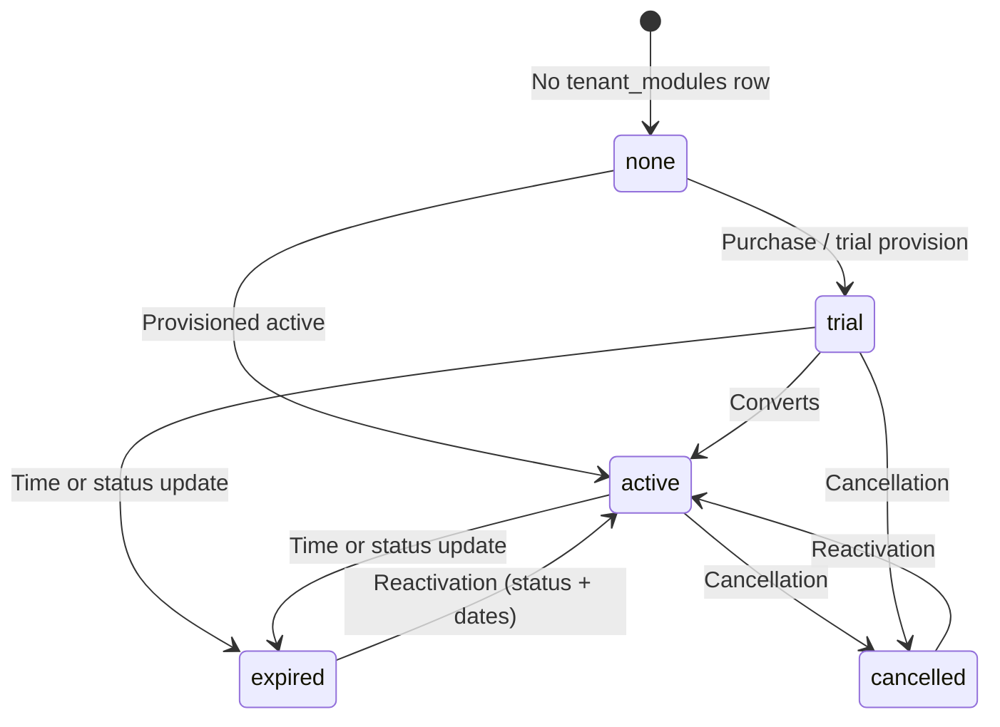

# Creator Module — Phase 9 (polish, edge cases, ops)

Production-facing behavior for the Creator (Prostaff) tenant add-on: UX copy, shared Inertia flags, API error shape, audit events, admin grant tooling, and safe downgrade (no data deletion).

## Lifecycle



- **Entitlement** (uploads, assign, manager dashboard JSON) is enforced by {@see \App\Services\Prostaff\EnsureCreatorModuleEnabled} and {@see \App\Services\FeatureGate::creatorModuleEnabled()}.
- **Read-mostly behavior** when inactive: DAM prostaff filter options return `[]`; prostaff filter query params on the asset grid do not apply when the module is off ({@see \App\Http\Controllers\AssetController}).

## UX messaging

- {@see \App\Services\CreatorModuleMessageService::getExpiredMessage()} — copy shown when entitlement checks fail and in API payloads:
  - *"Creator Module is no longer active. Reactivate to continue managing your creators."*

## Global Inertia prop

Shared on all Inertia responses via {@see \App\Http\Middleware\HandleInertiaRequests}:

- `creator_module_status`: `{ enabled: bool, status: 'active'|'trial'|'expired'|'cancelled'|null, expires_at: ISO8601|null }`
- `status` reflects the stored row when terminal (`expired` / `cancelled`). If the row is `active`/`trial` but dates or admin rules deny entitlement, `enabled` is `false` and `status` is surfaced as `expired` for banner consistency.

## API error shape (assign, upload complete, dashboard JSON)

HTTP **403** with body:

```json
{
  "error": "creator_module_inactive",
  "message": "Creator Module is no longer active. Reactivate to continue managing your creators.",
  "action": "upgrade"
}
```

- **Dashboard**: {@see \App\Http\Controllers\Prostaff\ProstaffDashboardController} (`index`, `me`).
- **Assign**: `POST /app/api/brands/{brand}/prostaff/members` — {@see \App\Http\Controllers\Prostaff\ProstaffMembershipController::store}.
- **Upload**: `POST …/upload/complete` — {@see \App\Http\Controllers\UploadController::complete}; batch finalize merges the same keys into each failed manifest item when the completion service throws {@see \App\Exceptions\CreatorModuleInactiveException}.

Exception type: {@see \App\Exceptions\CreatorModuleInactiveException} (extends `DomainException`).

## Audit logging (activity_events)

Registered {@see \App\Observers\TenantModuleObserver} on {@see \App\Models\TenantModule} for `module_key = creator_module`:

| Event | `event_type` |
|-------|----------------|
| Module becomes entitled (new active/trial row that passes date/admin rules) | `tenant_module.creator.activated` |
| Status set to `expired` | `tenant_module.creator.expired` |
| Status set to `cancelled` | `tenant_module.creator.cancelled` |

Admin / ops grant (always sets `granted_by_admin = true` and requires `expires_at`):

- {@see \App\Services\GrantCreatorModuleToTenant} records `tenant_module.creator.admin_granted` with actor and expiry metadata.

Event constants: {@see \App\Enums\EventType} (`CREATOR_MODULE_*`).

## Admin override rules

- {@see \App\Services\GrantCreatorModuleToTenant::grant()} **requires** a non-null `expires_at` (throws `InvalidArgumentException` if missing).
- Persisted rows must still satisfy {@see \App\Models\TenantModule} saving rules (`granted_by_admin` ⇒ `expires_at` present).

## Safe downgrade (module expired / off)

- **prostaff_memberships** and **prostaff_period_stats** are **not** deleted when the module expires.
- **Uploads** for prostaff actors are blocked in {@see \App\Services\UploadCompletionService}.
- **Stats** remain queryable for future reporting.
- **Filters**: prostaff member options endpoint returns `[]` when the module is inactive.

## Reserved columns (no business logic yet)

- `tenant_modules.seats_limit` — nullable integer (Phase 9 migration).
- `prostaff_memberships.tier` — nullable string, indexed (Phase 8 migration).

## Tests

{@see Tests\Feature\CreatorModuleFinalizationTest} — structured errors, Inertia prop, grant validation, audit events, data retention on expire.

{@see Tests\Feature\CreatorModuleGateTest} — gate + API error contract updated for Phase 9 messaging.

## Out of scope (explicit)

- Stripe / billing automation for the module.
- Frontend implementation (props and JSON are contract-only).
- Rewrites of existing schema beyond additive columns.
