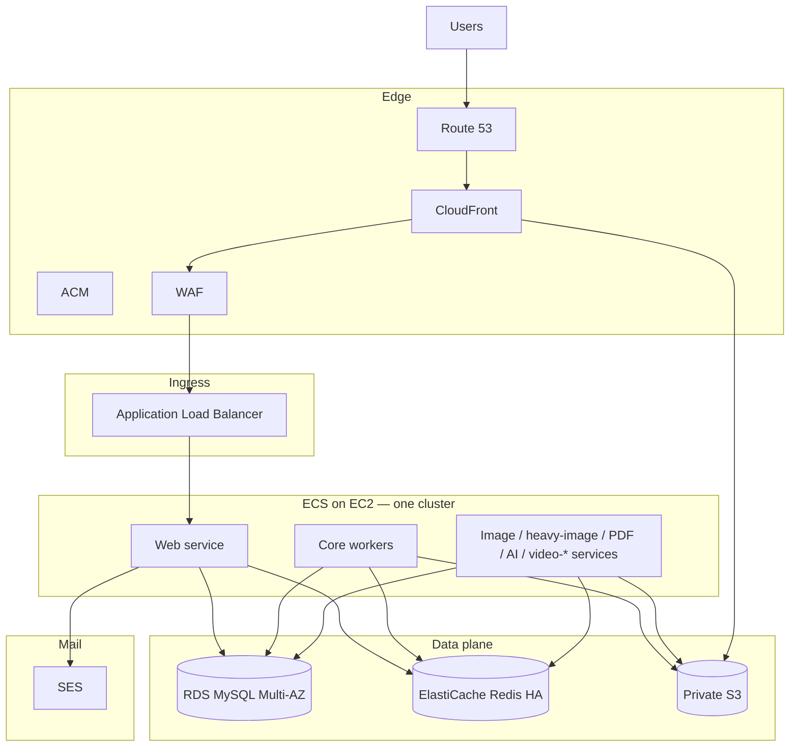

# Production architecture — AWS (Jackpot)

**Prepared for:** Jackpot DAM production rollout  
**Primary goals:** Enterprise-grade reliability, cost-aware baseline, no future re-architecture, independent scaling for web and workers  
**Recommended compute model:** **Amazon ECS on EC2** with separate capacity providers / Auto Scaling Groups by workload class  
**Status:** Recommended target-state design for first production implementation  

**Repository copy:** This file is the **git-tracked** version of the internal design doc. Keep it aligned with `S:\Design\Jackpot\Production Env\jackpot-production-architecture.docx` when either changes.

**Application:** Laravel 12, Inertia/React, Vite. Regional defaults in config often use `us-east-1` (`config/services.php`, `config/storage.php`).

**Baseline intent:** Two always-on web tasks across **2 AZs**, warm core processing lanes, separate **heavy-media** and **heavy-video** burst lanes, **RDS Multi-AZ**, **ElastiCache HA**, **private S3 behind CloudFront**, and **ECS-backed CI/CD** with rollout controls.

---

## Executive summary

Production should launch as an **AWS-native, two-Availability-Zone** environment: low initial volume but structured to **scale without redesign**. The platform choice is **Amazon ECS on EC2**, not Elastic Beanstalk and not plain unmanaged EC2 Auto Scaling as the primary control plane. That keeps template-driven host pools while adding container orchestration, service-level scaling, health replacement, deployments, and **clean separation of workload classes**.

Priorities: **tenant-safe asset protection**, **independent scaling** of customer-facing vs background work, and a **lean but serious** cost floor.

**Recovery targets (design goals):** RPO ≤ ~5 minutes, RTO ~15–30 minutes for major app-tier issues; continued customer-facing availability through a **single instance or single-AZ loss**; **controlled degradation of background processing** rather than app downtime when workers are stressed.

---

## Scope & related docs

This page is the **environment and operations** story. It does not replace:

| Document | Contents |
|----------|----------|
| [SERVER_REQUIREMENTS.md](SERVER_REQUIREMENTS.md) | OS binaries on workers (ImageMagick, FFmpeg, Poppler, etc.) |
| [../STORAGE.md](../STORAGE.md) | Tenant buckets, upload behaviour |
| [../UPLOAD_AND_QUEUE.md](../UPLOAD_AND_QUEUE.md) | Queue dispatch, pipeline |
| [../compliance/PATH_TO_GDPR.md](../compliance/PATH_TO_GDPR.md) | Privacy; AWS as processor |
| [../operations/DATA_EXPLOSION_RUNBOOK.md](../operations/DATA_EXPLOSION_RUNBOOK.md) | Runaway growth / caps |

---

## Final architecture decision: ECS on EC2

Use **one ECS cluster** and **separate capacity providers / Auto Scaling Groups** for **web** and each **major worker class**.

**Why ECS on EC2 (vs Elastic Beanstalk or raw EC2 ASG only)**

- Keeps the **server-template / pool** model while avoiding Beanstalk lock-in.  
- Fits **Docker-based** development (see repo `Dockerfile` / Sail).  
- **Web and worker services scale independently** at the task level; EC2 fleets scale underneath.  
- Rolling deployments, health checks, capacity providers, and future blue/green or canary patterns.  
- **Always-on workloads** tend to cost less than running the same patterns entirely on Fargate.

---

## Target production topology

| Layer | Service | Recommended posture | Notes |
|-------|---------|---------------------|--------|
| Edge | CloudFront | Always on | Private asset delivery; signed cookies (authenticated browsing); signed URLs (public / one-off) |
| Ingress | Application Load Balancer | Always on | Public entry only; TLS termination; route to web service |
| Web | ECS service on EC2 | Min **2** tasks | Spread across **2 AZs**; customer-facing app |
| Workers | Multiple ECS services on EC2 | Mixed min **0/1** | Each **queue class** isolated by capacity provider |
| Database | RDS MySQL **Multi-AZ** | Always on | Primary/standby failover, storage autoscaling, PITR |
| Queue / cache | ElastiCache Redis / Valkey | Always on | HA; alarms and headroom |
| Object storage | Amazon S3 | Always on | **Private** buckets; CloudFront **OAC** access |
| Operations | CloudWatch + Sentry + SSM | Always on | Metrics, logs, alarms, app errors, shell-less admin |

---

## Logical architecture (reference)

---

## Networking and availability

- **One VPC**, at least **two Availability Zones**.  
- **Public subnets** only for ALB (and any intentionally public edge resources).  
- **Private application subnets** for ECS container instances (web + workers).  
- **Private data subnets** for RDS and ElastiCache.  
- **No routine public SSH** — use **SSM Session Manager** for administration.  
- **Design rule:** Only the **ALB** should be internet-reachable; web and worker instances stay private.

**Goal:** App remains functional through a **single-AZ outage** via cross-AZ web capacity and managed failover for stateful services.

---

## Asset protection and delivery

Keep Jackpot’s **tenant-scoped CloudFront** model (see `config/cloudfront.php`, `config/cdn.php`):

| Pattern | Behaviour |
|---------|-----------|
| **Authenticated browsing** | Signed cookies scoped to tenant asset paths (e.g. `/tenants/{tenant_uuid}/*`), refresh before expiry |
| **Public collections, downloads, one-off admin** | **Signed URLs**, short TTLs per flow |
| **Buckets** | **Private** S3 only; **CloudFront Origin Access Control** + restrictive bucket policies |
| **Separation** | Web tier **mints** signatures; **narrow** S3 write scope. Workers get **only** the read/write scopes needed for processing |

**Future hardening:** Centralize signing-key management; avoid treating the CloudFront private key as an ordinary file on servers long-term.

---

## ECS services, queues, and capacity layout

| Service / lane | Queue(s) | Purpose | Min | Max | Notes |
|----------------|----------|---------|-----|-----|--------|
| **web** | n/a | Customer-facing PHP/Laravel | **2** | 6 | Always warm, 2 AZs |
| **core-workers** | `default`, `downloads` | Mail, webhooks, notifications, bundling, light async | **1** | 3 | Never scale to zero |
| **image-workers** | `images` | Standard thumbnails, ordinary processing | **1** | 4 | Primary image lane |
| **heavy-image-workers** | `images-heavy` | Large originals, memory-heavy raster | **1** | 4 | Separate instance class; lower concurrency |
| **pdf-workers** | `pdf-processing` | PDF render, extraction, OCR/text | **1** | 3 | Isolated from image lane |
| **ai-workers** | `ai`, `ai-low` | LLM / enrichment | **1** | 4 | Scale on queue age + backlog |
| **video-light-workers** | `video-light` *(target)* | Poster frames, quick previews, common post-upload UX | **1** | 3 | Always warm |
| **video-heavy-workers** | `video-heavy` *(target)* | Large/long video, high RAM / temp storage | **0** | 2 | Burst; cold-start acceptable |

Horizon supervisors in code today: `supervisor-default`, `supervisor-images`, `supervisor-images-heavy`, `supervisor-pdf-processing`, `supervisor-ai` — see `config/horizon.php`. **Video queues** are part of the **target** topology; add queues + supervisors when the pipeline is wired.

**Scaling signal:** Prefer **queue age / wait time** over CPU alone for workers. Keep **heavy** lanes from competing for RAM with normal image work. Route oversized PSD/PSB/TIFF/raster jobs to **heavy-image** explicitly.

---

## Queue strategy and Horizon mapping

Run **Horizon inside each ECS service** and align **service boundaries** with **infrastructure** boundaries (not merely multiple supervisors on one generic host).

| Current Horizon pool (`config/horizon.php`) | Target ECS service | Action |
|---------------------------------------------|---------------------|--------|
| `supervisor-default` | **core-workers** | Dedicated service |
| `supervisor-images` | **image-workers** | Isolate from heavy + video load |
| `supervisor-images-heavy` | **heavy-image-workers** | Optional routing rules for oversized rasters |
| `supervisor-pdf-processing` | **pdf-workers** | Dedicated PDF service |
| `supervisor-ai` | **ai-workers** | `ai` + `ai-low` together initially; split only if metrics justify |
| *(add when ready)* | **video-light-workers** | New always-warm service |
| *(add when ready)* | **video-heavy-workers** | New burst service, min 0 |

**Queue connection:** Production typically uses **Redis** for Horizon (`config/queue.php` supports `database` default locally; align `QUEUE_CONNECTION` and Redis for prod).

---

## Video processing model

Two operational classes — important for **cost and reliability**.

**Tier 1 — `video-light` (always warm)**  
Poster / screenshot extraction, quick preview MP4 from stills, ordinary post-upload previews. **Min 1** task; keep the lane hot.

**Tier 2 — `video-heavy` (burstable)**  
Very large/long sources, high-RAM extraction, expensive renders. **Min 0**; scale from backlog. **Cold-start is an accepted tradeoff** — reflect in UX and job status, not as failure.

---

## Database and Redis

**RDS**

- Start with **RDS MySQL Multi-AZ** (not Aurora for v1; not single-AZ production).  
- Automated backups, **PITR**, storage autoscaling.  
- Scale **vertically** first; add **read replicas** only when metrics justify.  
- Avoid fragile DB choices that force migration under pressure later.

**ElastiCache**

- Managed Redis/Valkey with **failover** and **alarms**.  
- Headroom for Horizon metadata + queues; watch memory, latency, engine CPU.  
- **Backpressure** heavy workers before Redis destabilizes.  
- Revisit **cluster mode** only if scale exceeds a single shard’s comfort zone.

---

## Scaling rules (primary signals)

| Service | Primary scale-out | Secondary | Scale-in |
|---------|-------------------|-----------|----------|
| web | ALB requests / response time | CPU, memory | Slow (avoid churn) |
| core-workers | Oldest job age / wait | CPU | Conservative; stay warm |
| image-workers | Queue age (`images`) | CPU, memory | Moderate |
| heavy-image-workers | Queue age (`images-heavy`) | Memory | Conservative |
| pdf-workers | Queue age (`pdf-processing`) | CPU | Moderate |
| ai-workers | Queue age (`ai`, `ai-low`) | API timeouts / throughput | Moderate |
| video-light-workers | Queue age (`video-light`) | CPU, temp disk | Conservative; stay warm |
| video-heavy-workers | Queue age (`video-heavy`) | CPU, memory | May scale to zero after idle |

---

## Security posture

- **IAM per workload class** — web does **not** get broad S3 write; workers get **minimal** scopes.  
- **SSM Session Manager** as normal admin path; avoid routine SSH.  
- **No direct public S3** for protected objects; CloudFront is the delivery path.  
- **CloudTrail** + **GuardDuty** early.  
- **WAF** on public entry when ready (even a basic ruleset).  
- **Encryption at rest** — AWS-managed defaults first; customer-managed KMS later if required.

---

## CI/CD and deployment

Symlink-based deploy scripts (e.g. `scripts/web-mirror-deploy.sh` style) are valid **history**, but **long-term production** should be **image-based** and **ECS-controlled**.

**Recommended pipeline**

1. Build images in **CI** (e.g. GitHub Actions).  
2. Tests + static checks before publish.  
3. Push **versioned** images to **Amazon ECR**.  
4. Deploy to ECS with **rolling updates**, health checks, **rollback** thresholds.  
5. **Separate** database migrations from ordinary task rollout — controlled, observable.  
6. **Secrets** via managed store + task definitions — not mutable host files.

**Keep from the old model:** preflight discipline, rollback mindset, web vs worker separation, deploy logging.

---

## Production monitoring and alarms

- **CloudWatch** dashboards: ALB, ECS, EC2, RDS, ElastiCache, S3/CloudFront high-level.  
- **Alarms:** HTTP 5xx, target response time, unhealthy targets, task restarts, **queue age**, queue depth, **Redis memory / CPU**, RDS CPU/connections/free storage/failover.  
- **Sentry** for application exceptions.  
- Logs → **CloudWatch Logs**; define retention.  
- Route alarms to email/chat; paging later.

---

## Production cost (order of magnitude)

Baseline is **not** ultra-cheap if run seriously: **2 web tasks**, warm **core / image / PDF / AI / video-light**, RDS Multi-AZ, ElastiCache HA, ALB, CloudFront, private networking.

| Scenario | Est. monthly (USD) | Commentary |
|----------|-------------------|------------|
| Ultra-lean serious prod | **$400–$550** | Tight right-sizing, minimal waste |
| **Recommended healthy baseline** | **$550–$850** | Realistic serious production without overbuilding |
| Busy / heavier traffic | **$850+** | Storage, egress, AI, burst compute |

Drivers: **RDS**, **ElastiCache**, **NAT**, always-on compute before CloudFront. **S3 + egress** grow with tenant TBs. **AI/API** spend is separate and can rise fast.

---

## Implementation phases

**Phase 1 — Foundation**  
VPC, subnets, routing, SGs, endpoints. RDS Multi-AZ MySQL, ElastiCache, private S3, CloudFront, ALB. ECR repos, IAM for web/workers/CI/ECS. CloudTrail, GuardDuty, log groups, initial alarms.

**Phase 2 — ECS**  
Containerize web and workers. Cluster + capacity providers / ASGs per class. Services: web, core-, image-, heavy-image-, pdf-, ai-, video-light-, video-heavy-workers. Set min/max/desired from tables above.

**Phase 3 — Pipeline**  
CI build → test → ECR → ECS deploy. Migration policy + rollback. Secrets in managed store. Staging cutover tests → controlled production promotion.

**Phase 4 — Tuning**  
Measure queue age, CPU, memory, job duration by lane. Refine thresholds and task sizes. Read replicas, Redis cluster mode, Spot, warm pools — **only after** production data supports them.

---

## Day-one configuration snapshot

| Service | Min | Max | Guidance |
|---------|-----|-----|----------|
| web | **2** | 6 | Always warm, 2 AZs |
| core-workers | **1** | 3 | Never zero |
| image-workers | **1** | 4 | Primary thumbnail lane |
| heavy-image-workers | **1** | 4 | Large jobs, lower concurrency |
| pdf-workers | **1** | 3 | Document lane |
| ai-workers | **1** | 4 | Queue age + provider throughput |
| video-light-workers | **1** | 3 | Always warm *(when queues exist)* |
| video-heavy-workers | **0** | 2 | Cold-start OK *(when queues exist)* |

---

## Architecture principles (keep locked)

1. Do **not** weaken production architecture purely to lower the first month’s bill if it forces a painful migration later.  
2. Do **not** merge heavy and light workload classes without **metrics** proving it.  
3. Do **not** give web **broad S3 write** access.  
4. Do **not** rely on emergency scaling to fix **Redis exhaustion** — headroom + backpressure.  
5. Do **not** assume **staging** patterns are sufficient for **production** isolation and automation.

---

## Closing recommendation

Proceed with **ECS on EC2**, **two AZs**, **RDS Multi-AZ**, **ElastiCache HA**, **CloudFront in front of private S3**, and **queue-isolated worker services**. This matches **enterprise expectations**, **small-team operability**, and **growth without redesigning the core shape**.

---

## Application configuration notes (Laravel)

| Topic | Config |
|-------|--------|
| Horizon | `config/horizon.php` — supervisors, queues, `waits` thresholds |
| Queues | `config/queue.php` — connection names; production Redis typical for Horizon |
| CloudFront / CDN | `config/cloudfront.php`, `config/cdn.php` |
| S3 | `config/storage.php`, `config/filesystems.php` |
| Mail | `config/services.php` (SES) |

---

## Changelog

| Date | Change |
|------|--------|
| 2026-04-21 | Full sync from internal architecture narrative (ECS on EC2, topology, workers, video tiers, cost, phases). Video ECS services marked *target* until queues exist in `config/horizon.php`. |
